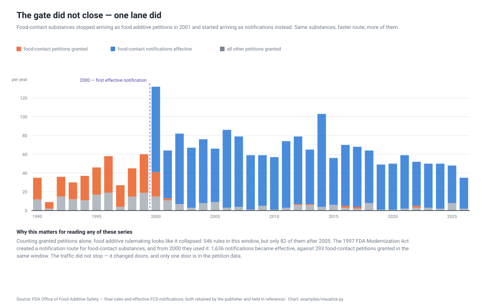
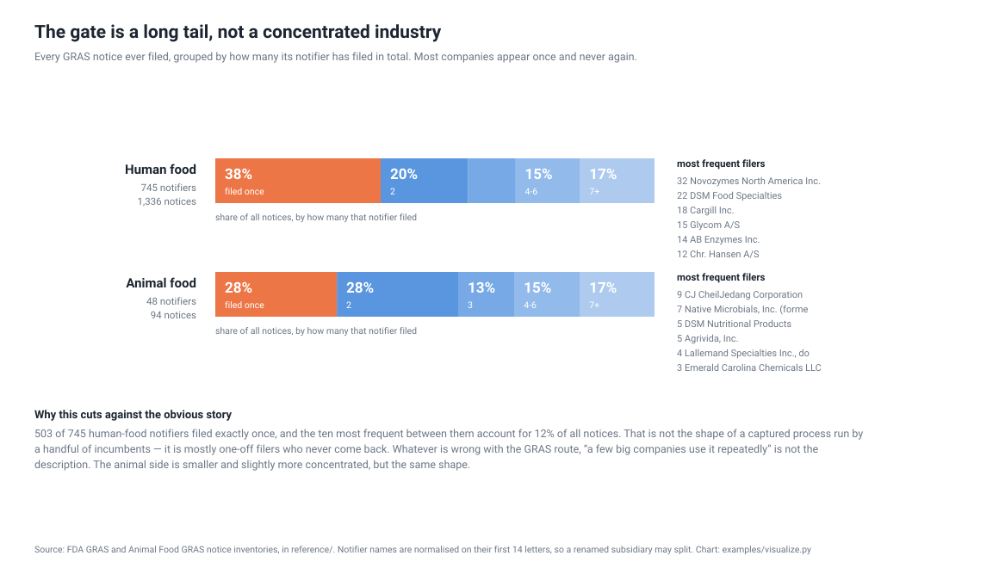
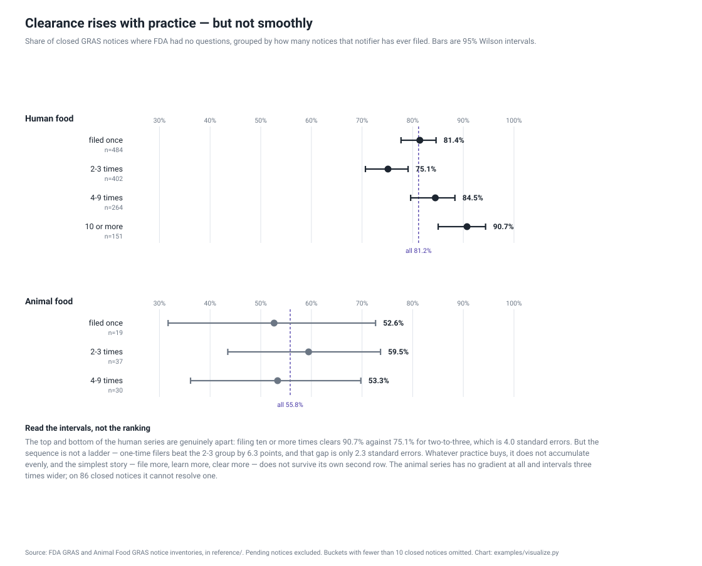
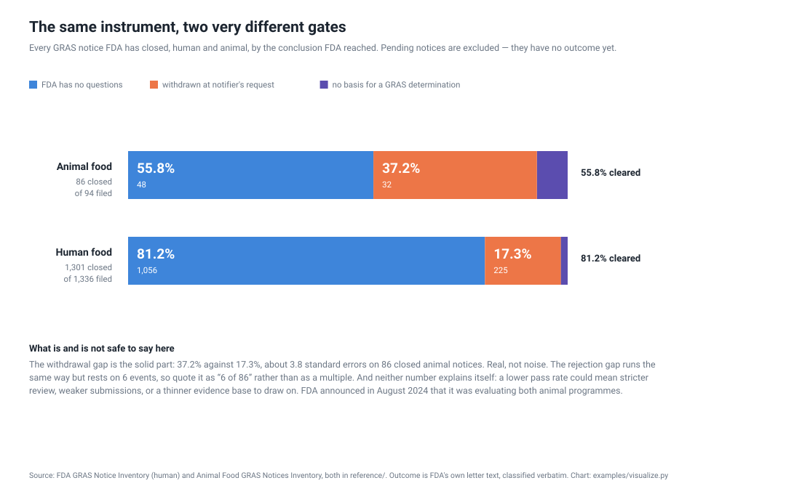

<h1 align="center">wss-food-trace</h1>

<p align="center">
  <strong>The regulatory gate on the food supply, kept where the queue is deleted</strong>
</p>

<div align="center">

  <a href="https://github.com/q3dresearch/wss-food-trace/actions/workflows/capture-monthly.yml"></a>
  <a href="https://github.com/q3dresearch/wss-food-trace/commits"></a>
  <a href="https://github.com/q3dresearch/wss-food-trace/blob/main/LICENSE"></a>
  <a href="https://github.com/q3dresearch/wss-food-trace"></a>

</div>

<p align="center">
  <sub>fleet: <a href="https://github.com/q3dresearch/wss-engine">engine</a> · <a href="https://github.com/q3dresearch/wss-hugging-face">hugging face</a> · <a href="https://github.com/q3dresearch/wss-openrouter">openrouter</a> · <a href="https://github.com/q3dresearch/wss-cloud-footprint">cloud footprint</a> · <a href="https://github.com/q3dresearch/wss-mining-pipeline">mining</a> · <a href="https://github.com/q3dresearch/wss-forest-harvest">forest</a> · <strong>food</strong></sub>
</p>

**Every substance in the food supply passed through a gate. FDA publishes what
is queued at that gate today, and deletes it once it resolves.**

A petition to permit, expand or revoke a food or colour additive sits on a page
headed *"Under Review or Held in Abeyance — as of \<date\>"*. When it resolves,
the row disappears. Grants survive as rules in 21 CFR. **Denials and
withdrawals leave nothing** — no record the petition existed, how long it sat,
or which way it went.

This repository takes that page, and two others like it, once a month.

## What one capture already shows

### The gate did not close — one lane did



Counting granted petitions alone, food additive rulemaking looks like collapse:
546 rules between 1990 and 2026, only 82 after 2005. **That reading is wrong.**
Food-contact petitions run 26, 29, 39, 23, 30, 41, 26 through 2000 — then
**2, 0, 0, 0**. A cliff, not a slope.

The 1997 FDA Modernization Act created a *notification* route for food-contact
substances, and from 2000 they used it: **1,636 notifications effective against
293 petitions granted** in the same window. Meanwhile food additive rules
genuinely declined and **colour additive rules rose**. None of that is visible
in the total.

### The enforcement list and the notification system barely overlap

**19 of the 20 substances FDA has declared *not* GRAS never filed a notice at
all** — CBD, delta-8-THC, kava, tianeptine, betel nut, tara flour. The one
exception, Ginkgo biloba (GRN 36), was withdrawn in 2000 and determined not
GRAS afterwards.

### The gate is a long tail, not a concentrated industry



**503 of 745 human-food notifiers filed exactly once**; the ten most frequent
account for 12% of all notices. Whatever is wrong with the GRAS route, *"a few
big companies use it repeatedly"* is not the description.

Filing once means having one novel ingredient, not vanishing — one-time filers
clear at 81.4% against 81.2% overall.

### Clearance rises with practice, but not smoothly



Notifiers who have filed **ten or more times clear at 90.7%**, against 75.1%
for those filing two or three — 4.0 standard errors apart. But it is not a
ladder: one-time filers *beat* the 2–3 group. The animal series has no gradient
at all and intervals three times wider; on 86 closed notices it cannot resolve
one.

### Animal ingredients clear at two thirds the human rate



**55.8% against 81.2%.** The withdrawal gap — 37.2% vs 17.3% — is about 3.8
standard errors and real. The rejection gap runs the same way but rests on six
events, so it is quoted as "6 of 86" rather than as a multiple. FDA announced
in August 2024 that it was evaluating both animal programmes.

## What the archive will answer that nothing can today

| question | needs |
| --- | --- |
| How long does a petition sit before anything happens? | two captures |
| Which flip between *under review* and *held in abeyance*? | two captures |
| **Which vanish with no matching final rule — i.e. were abandoned?** | a capture, then the join to `reference/final-rules.csv` |
| Does the not-GRAS list keep growing from substances that never filed? | a year |

The third is the point, and the join key already works: 91% of the 609 rules
carry a petition number. It found this on the first run —

> **FAP 9M4697**, ionizing radiation. FDA granted **part** of it in August 2008
> (iceberg lettuce and spinach, 21 CFR 179.26). The same petition is **still**
> held in abeyance in 2026 for the rest. A partial grant with the remainder
> waiting eighteen years — visible in neither half alone.

Full list, with honest status per row, in
[`docs/research-questions.md`](docs/research-questions.md).

## Sources

| source | rows | cadence | what perishes |
| --- | --- | --- | --- |
| `fda.additives.petitions` | 32 open | monthly | resolved petitions leave the page |
| `fda.animalfeed.consultations` | 9 | monthly | an explicitly *interim* programme; the page goes with it |
| `fda.additives.notgras` | 20 | monthly | nothing — but the list carries **no dates**, so only an archive can say *when* |

`reference/` holds the self-archiving other half, cited rather than captured:
609 final rules back to 1975, 1,760 food-contact notifications, and both GRAS
inventories. `examples/refresh_reference.py` rebuilds it.

## On the one name in this data

Petitioners are overwhelmingly companies; at first capture one of 32 was a
private citizen. The registry declares `personal_data: parties_only`, which the
engine permits only with written justification, and **the derived tables carry
no petitioner column** — every question above uses the petition number, so
deleting the names leaves the dataset intact.

The raw archive is the page as FDA served it, because raw bytes are stored
verbatim. Redacting a name while keeping the petition number would buy nothing:
the number resolves to the petitioner on FDA's own site.

## Running it

```bash
pip install "wss @ git+https://github.com/q3dresearch/wss-engine.git@v0.6.0"
export WSS_CONTACT="https://github.com/q3dresearch/wss-food-trace"

wss validate                       # registry schema check; CI gate
wss capture --cadence monthly      # fetch → gate → hash → dedupe → write → manifest
wss derive                         # raw → derived/observations
wss sources                        # regenerate SOURCES.md
python examples/refresh_reference.py
python examples/visualize.py       # five charts, stdlib only
```

Every observation carries `source_id` and `raw_ref`. The matching manifest row
holds that `raw_ref` with the URL, fetch time and a SHA-256 of exactly what came
back, so any number here traces to the bytes it came from.

## Notes for the next person

Four things cost a debugging round each.

- **`observed_at` comes from the page, not the clock.** FDA states the queue's
  as-of date in the heading and the parser **raises** if it cannot find it.
  Falling back to fetch time would stamp an unchanged queue with a new
  timestamp every month and invent movement that never happened.
- **The date is only adjacent to the heading after tags are stripped**, and
  `<script>` bodies must be removed first or analytics source lands between
  them.
- **The FDA app paginates silently.** `set=FinalRules` returns 51 rows back to
  2014 while claiming coverage since 1994 — it reads exactly like a rolling
  window. `showAll=true` returns 609 back to 1975. The same test on the
  petitions queue returns 32 either way, which is what proves *that* one really
  is only the open queue.
- **The AFIC page is Drupal**, which stamps a random `js-view-dom-id` into every
  render. Identical data, identical byte count, different SHA — dedupe never
  fires and storage grows for ever. Handled with `dedupe_ignore` in the
  registry, which strips it for change detection only and leaves the archived
  bytes untouched.
